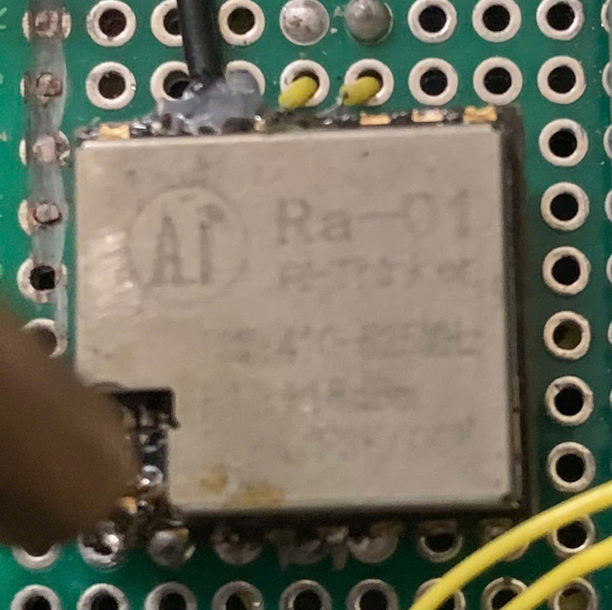
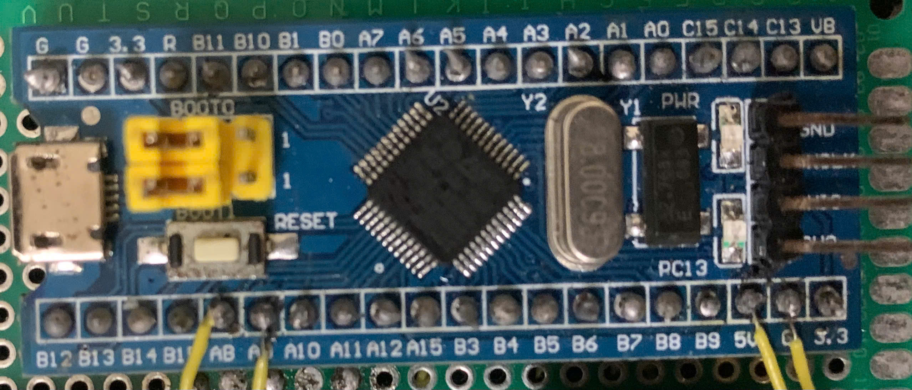

Author: Dương Xuân Ngọc.
(siculasound)
# **Truyền thông không dây Lora sử dụng sx1278**
## **Tính năng**
- Khoảng cách truyền > 1km.
- cấu hình được các thông số quan trọng như băng thông, tần số sóng mang, trải phổ, tốc độ mã hóa..v.v
- bảo vệ quá dòng.
- chế độ ngủ để tiết kiệm năng lượng.
- dễ dàng sử dụng.
## **Phần cứng**
- module lora ra-01 sx1278.

  

- STM32f103c8t6.

  

## **Kết nối chân sx1278 với stm32f103**
  RA-01 sx1278 sử dụng giao tiếp spi 
  | STM32 | RA-01 |
|-----------------------|-----------|
| A5 (SCK)  | SCK  |
| A6 (MISO) | MISO |
| A7 (MOSI) | MOSI |
| B0 (output high) | NSS |
| B1 (output high) | RESET |
| A10 (EXTI)  | DIO0 |
| 3.3v | 3.3v |
| GND | GND |

